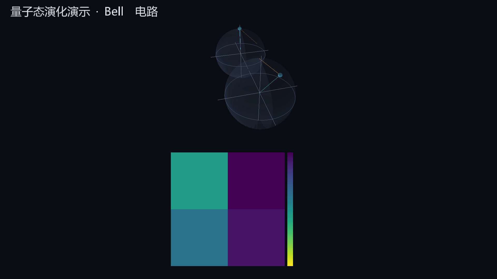
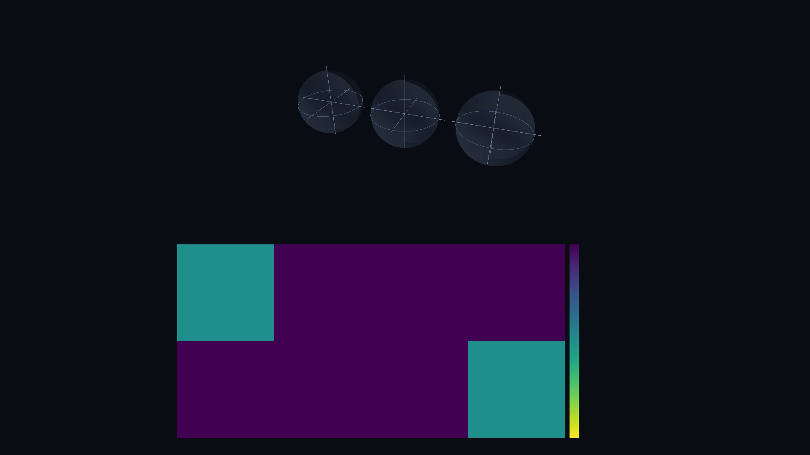

<div align="center">

# ⚛️ gpuqviz

**GPU 加速的量子态演化可视化与视频渲染库**

把 qiskit 电路一键渲染成布洛赫球与概率热图动画 —— matplotlib 方案 30 分钟的活，这里 20 秒干完。

[](https://pypi.org/project/gpuqviz/)
[](https://www.python.org/)
[](https://github.com/Poplavis/gpuqviz/blob/main/LICENSE)
[](https://github.com/Poplavis/gpuqviz/actions/workflows/ci.yml)

</div>

---

## 为什么需要它

用 matplotlib 逐帧渲染 15 秒的量子态演化视频，通常要等 **30+ 分钟**：CPU 光栅化、逐帧写 PNG、ffmpeg 软编码，三头慢。

gpuqviz 把整条流水线搬到 GPU 上：**离屏 GLSL 渲染 → 显存直取 → 进程内编码 → MP4**，全程零中间文件；只仿真约 120 个关键帧，输出帧率由球面插值在 GPU 上补齐。15 秒 1080p60 视频，**20 秒出片**。

| | 传统方案 | gpuqviz |
|---|---|---|
| 渲染 | matplotlib 逐帧 CPU 光栅化 | GLSL 着色器离屏渲染 |
| 中间产物 | 每帧一张 PNG | 无（帧直接进编码器） |
| 编码 | ffmpeg 子进程软编码 | NVENC 硬编码 → PyAV 回退 |
| 帧率 | 仿真多少帧就多少帧 | 关键帧 + slerp 插值，任意帧率 |

## 演示

**布洛赫球 + 概率热图分屏**（相机环绕动画，SDF 中文标题）：



**GHZ 态三 qubit 演化**：



> 视频样例见 `examples/` 目录脚本一键生成：`python examples/showcase.py`

## 特性

- ⚡ **快**：GPU 光栅化 + 关键帧插值，15s@60fps 视频秒级~分钟级出片
- 📦 **零中间文件**：FBO 帧直通进程内编码器，不落盘
- 🎥 **NVENC 硬编码**（可选）：cupy RGBA → GPU NV12 kernel → NVENC，全程不下显存；不可用时自动回退 `libx264`
- 🎨 **多种渲染器**：布洛赫球（Phong 球壳/轨迹尾/多 qubit）、概率/相位热图（viridis/inferno）、相位色盘
- 📝 **SDF 中文标注**：freetype 烘焙图集，任意字号锐利，运行时零 freetype 依赖
- 🎬 **Scene 声明式 API**：JSON 场景文件 + CLI 一条命令出片，相机轨道动画
- 🧊 **CPU 回退后端**：无 OpenGL 环境自动降级 numpy 软光栅（limited 样式）
- 🔬 **qiskit 原生衔接**：直接吃 `QuantumCircuit` / `Statevector`，qiskit 仅为可选依赖
- 🐼 **pyqpanda 兼容**：本源量子 `QProg` 经 ORIGINIR 转换 + 内置 numpy 态矢量模拟器接入，`pip install gpuqviz[pyqpanda]`
- 🖱️ **交互式 3D 播放器**：导出单文件 HTML（约 0.7MB，离线可开）——播放/暂停、0.25×~4× 倍速、时间轴拖动、鼠标旋转缩放视角，下方实时显示各基态概率/振幅/相位与 Bloch 向量

## 安装

```bash
pip install gpuqviz[qiskit]     # 推荐：qiskit 输入支持
pip install gpuqviz[gpu]        # 追加 CUDA 12.x（cupy + NVENC，需 Python ≥3.10）
pip install gpuqviz[preview]    # 追加实时预览
```

<details>
<summary>环境要求</summary>

- Python ≥ 3.9（NVENC 硬编码路径需 ≥ 3.10）
- 任何支持 OpenGL 3.3 的 GPU（**无 N 卡也能跑**，编码自动回退软编码）
- 可选：NVIDIA GPU + CUDA 12.x（cupy 加速 + NVENC）

</details>

## 快速上手

### 一行出片

```python
from qiskit import QuantumCircuit
from gpuqviz import render_bloch_video

qc = QuantumCircuit(2)
qc.h(0)
qc.cx(0, 1)

render_bloch_video(circuit=qc, out="out/bell.mp4")   # 1080p60 布洛赫球动画
```

### 概率热图

```python
from gpuqviz import render_heatmap_video

render_heatmap_video(circuit=qc, basis="probability", out="out/hm.mp4")
```

### Scene 声明式 API

```python
from gpuqviz import render
from gpuqviz.scene import Scene, BlochTrack, HeatmapTrack, Camera

scene = Scene(
    duration=5.0, fps=60,
    title="贝尔态演化",
    camera=Camera(azimuth=(0.0, 60.0), elevation=(25.0, 35.0)),  # 相机轨道动画
    tracks=[
        BlochTrack(states_path="states.npz", trail=True, layout="top"),
        HeatmapTrack(states_path="states.npz", basis="probability", layout="bottom"),
    ],
)
render(scene, out="out/scene.mp4")
```

态矢量数据准备：`np.savez("states.npz", states=key_states)`，形状 `(K, 2**n)` complex，
K 为关键帧数。场景可持久化为 JSON：[examples/scene.json](examples/scene.json)。

### 交互式 3D 播放器（单文件 HTML）

```python
from gpuqviz import export_html

export_html(circuit=qc, out="out/viewer.html", title="贝尔态演化")
```

双击 `viewer.html` 即可打开：3D 视口（鼠标拖拽旋转 / 滚轮缩放）、播放/暂停（空格）、
0.25×~4× 倍速、时间轴拖动（←/→ 逐帧步进），底部实时显示当前量子状态——
每个基态的概率条、振幅与相位，以及各 qubit 的 Bloch 向量。

### pyqpanda（本源量子）电路

```python
pip install gpuqviz[pyqpanda]

from pyqpanda import CPUQVM, QProg, H, CNOT
from gpuqviz import render_bloch_video

qm = CPUQVM(); qm.init_qvm()
q = qm.qAlloc_many(2)
prog = QProg(); prog << H(q[0]) << CNOT(q[0], q[1])

render_bloch_video(circuit=prog, machine=qm, out="out/bell.mp4")   # 与 qiskit 同一套 API
```

所有入口（`render_bloch_video` / `render_heatmap_video` / `export_html`）均接受
`machine=` 参数直接吃 pyqpanda `QProg`。注意：pyqpanda 的 ORIGINIR 转换必须使用
创建 prog 的同一虚拟机实例，跨实例转换会在原生层崩溃（pyqpanda 已知行为）。

### CLI

```bash
gpuqviz env                           # 环境能力自检（CUDA / OpenGL / NVENC / qiskit）
gpuqviz render scene.json -o out.mp4  # JSON 场景出片
gpuqviz export scene.json -o viewer.html   # 交互式 3D 播放器导出
gpuqviz preview scene.json            # 实时预览（需 [preview] 扩展）
```

## API 速览

| 函数 | 用途 |
|---|---|
| `render_bloch_video(circuit=…, steps=120, fps=60, trail=…)` | 布洛赫球动画 |
| `render_heatmap_video(states=…, basis=…, colormap=…)` | 概率/相位/幅值热图动画 |
| `render(scene)` | 渲染 Scene 对象 |
| `report_env()` | 环境能力报告 |

完整 API 见 [docs/api.md](docs/api.md)，设计文档见 [DESIGN.md](DESIGN.md)。

## 后端矩阵

| 能力 | gl 后端（默认） | cpu 后端（自动降级） |
|---|---|---|
| 布洛赫球（光照/轨迹/多 qubit） | ✅ 完整 | ✅ 正交投影 limited |
| 概率/相位热图 | ✅ | ❌ |
| SDF 文字 / 相机动画 | ✅ | ❌ |
| 编码链 | NVENC → nvenc(av) → libx264 | libx264 |

自动降级策略：任何一环缺失（无 N 卡、驱动不支持 NVENC、无 OpenGL）都只降速不报错，
`gpuqviz env` 会输出各项能力状态与推荐后端。

## 性能

消费级 NVIDIA GPU（NVENC 不可用，编码回退 libx264）实测，详见 [docs/benchmarks.md](docs/benchmarks.md)：

| 场景 | gl 后端 | cpu 软光栅 |
|---|---|---|
| Bell 态 3s@30fps 720p | **3.9s** | 112.8s |

## 常见问题

<details>
<summary>NVENC 会话打不开（<code>nvEncOpenEncodeSessionEx error 2</code>）</summary>

部分驱动/显卡组合（如 Pascal + R581+ 安全驱动）会失败。库自动回退 PyAV 的
libx264，只影响速度不影响功能，可用 `gpuqviz env` 确认探测结果。
</details>

<details>
<summary>Linux 无显示环境能跑吗</summary>

能。moderngl 走 EGL headless 渲染，无需 X server（需安装 libegl）。
</details>

<details>
<summary>态矢量数据太大了（多 qubit）</summary>

热图与状态显示复杂度随 2^n 增长，建议 n ≤ 10；更大的系统请渲染约化密度矩阵
或局域观测量。
</details>

## 项目结构

```
src/gpuqviz/
├── api.py            # render_bloch_video / render_heatmap_video / render
├── scene.py          # Scene / BlochTrack / HeatmapTrack / Camera (pydantic)
├── evolve.py         # 电路采样 + 批量 einsum Bloch 向量
├── interpolate.py    # slerp / lerp 关键帧插值（含对跖点处理）
├── encode.py         # AvEncoder / NvencEncoder / 探测式回退
├── pipeline.py       # 底层渲染循环
├── render/           # GLContext、布洛赫球、热图、相位盘、SDF 文字、分屏
├── backends/         # 后端探测 + numpy 软光栅
└── assets/           # SDF 字体图集（随 wheel 分发）
```

## 开发

```bash
git clone <repo> && cd gpuqviz
pip install -e .[qiskit,dev]
python -m pytest tests -q          # 测试（23+ 用例）
python examples/showcase.py        # 生成演示视频
python benchmarks/suite.py         # 性能基准
python scripts/gen_font_atlas.py   # 重新烘焙字体图集
```

## Roadmap

- [x] 交互式 3D 播放器：导出单文件 HTML（播放/暂停/倍速/时间轴 + 当前量子状态面板），设计见 [docs/INTERACTIVE_VIEWER.md](docs/INTERACTIVE_VIEWER.md)
- [x] pyqpanda（本源量子）电路兼容
- [ ] CUDA-GL interop 零拷贝读回（当前 pinned memory）
- [ ] QASM 电路文件直接输入
- [ ] 更多国内模拟器适配（QPilotMachine / QCloud 等）

## License

Apache-2.0
