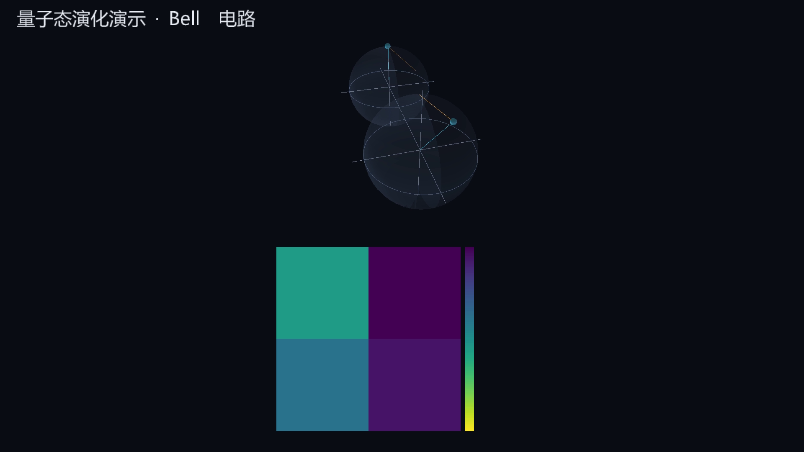
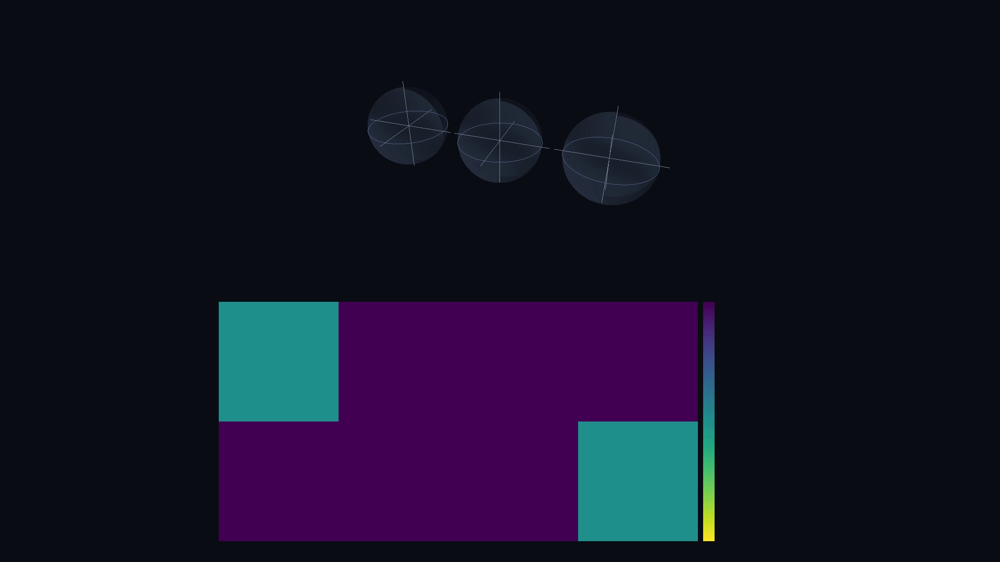

<div align="center">

# ⚛️ gpuqviz

**GPU 加速的量子态演化可视化与视频渲染库**

普通用户：把 qiskit 电路一键渲染成布洛赫球与概率热图动画 —— matplotlib 方案 30 分钟的活，这里 20 秒干完。
专业用户：测量统计、纠缠分析、噪声开放系统、条件门、参数化扫参、20+ qubit MPS —— 每个数字可对拍核对。

[](https://pypi.org/project/gpuqviz/)
[](https://www.python.org/)
[](https://github.com/Poplavis/gpuqviz/blob/main/LICENSE)
[](https://github.com/Poplavis/gpuqviz/actions/workflows/ci.yml)

</div>

---

## 为什么需要它

用 matplotlib 逐帧渲染 15 秒的量子态演化视频，通常要等 **30+ 分钟**：CPU 光栅化、逐帧写 PNG、ffmpeg 软编码，三头慢。

gpuqviz 把整条流水线搬到 GPU 上：**离屏 GLSL 渲染 → 显存直取 → 进程内编码 → MP4**，全程零中间文件；只仿真约 120 个关键帧，输出帧率由球面插值在 GPU 上补齐。15 秒 1080p60 视频，**20 秒出片**。

| | 传统方案 | gpuqviz |
|---|---|---|
| 渲染 | matplotlib 逐帧 CPU 光栅化 | GLSL 着色器离屏渲染 |
| 中间产物 | 每帧一张 PNG | 无（帧直接进编码器） |
| 编码 | ffmpeg 子进程软编码 | NVENC 硬编码 → PyAV 回退 |
| 帧率 | 仿真多少帧就多少帧 | 关键帧 + slerp 插值，任意帧率 |

## 演示

**布洛赫球 + 概率热图分屏**（相机环绕动画，SDF 中文标题）：



**GHZ 态三 qubit 演化**：



> 视频样例见 `examples/` 目录脚本一键生成：`python examples/showcase.py`

## 特性

- ⚡ **快**：GPU 光栅化 + 关键帧插值，15s@60fps 视频秒级~分钟级出片
- 📦 **零中间文件**：FBO 帧直通进程内编码器，不落盘
- 🎥 **NVENC 硬编码**（可选）：cupy RGBA → GPU NV12 kernel → NVENC，全程不下显存；不可用时自动回退 `libx264`
- 🎨 **多种渲染器**：布洛赫球（Phong 球壳/轨迹尾/多 qubit）、概率/相位热图（viridis/inferno）、相位色盘
- 📝 **SDF 中文标注**：freetype 烘焙图集，任意字号锐利，运行时零 freetype 依赖
- 🎬 **Scene 声明式 API**：JSON 场景文件 + CLI 一条命令出片，相机轨道动画
- 🧊 **CPU 回退后端**：无 OpenGL 环境自动降级 numpy 软光栅（limited 样式）
- 🔬 **qiskit 原生衔接**：直接吃 `QuantumCircuit` / `Statevector`，qiskit 仅为可选依赖
- 🐼 **pyqpanda 兼容**：本源量子 `QProg` 经 ORIGINIR 转换 + 内置 numpy 态矢量模拟器接入，`pip install gpuqviz[pyqpanda]`
- 🖱️ **交互式 3D 播放器**：导出单文件 HTML（约 0.7MB，离线可开）——播放/暂停、0.25×~4× 倍速、时间轴拖动、鼠标旋转缩放视角，下方实时显示各基态概率/振幅/相位与 Bloch 向量
- 📊 **专业测量统计**：精确概率 / 可复现 shot 采样（GPU 路径 n=24·10⁶ shots 亚秒）/ 全基矢振幅账本，与 qiskit/Aer 对拍（1e-10 / 1e-6）
- 🔗 **纠缠分析**：纠缠熵 · 互信息 · negativity · Schmidt 谱，一次 `entanglement_summary` 算全
- 🌊 **噪声开放系统**：Kraus 通道库（depolarizing / 弛豫 / 热弛豫，Aer 同约定），密度矩阵演化 + Hinton 图
- 🧪 **条件门与中途测量**：确定性经典反馈分支演化，隐形传态四分支对拍
- 🧬 **MPS 规模化**：20+ qubit χ 截断演化（SWAP 路由），约化分析量直喂渲染层
- 📐 **矢量输出 + LaTeX**：`render_svg` 出版级 SVG/PDF；`TextOverlay(latex=True)` mathtext 标注
- ⚙️ **参数化扫参**：符号参数模板 + 沿参数扫描全部分析量（VQE/QAOA 轨迹）

## 安装

```bash
pip install gpuqviz[qiskit]     # 推荐：qiskit 输入支持
pip install gpuqviz[gpu]        # 追加 CUDA 12.x（cupy + NVENC，需 Python ≥3.10）
pip install gpuqviz[preview]    # 追加实时预览
```

<details>
<summary>环境要求</summary>

- Python ≥ 3.9（NVENC 硬编码路径需 ≥ 3.10）
- 任何支持 OpenGL 3.3 的 GPU（**无 N 卡也能跑**，编码自动回退软编码）
- 可选：NVIDIA GPU + CUDA 12.x（cupy 加速 + NVENC）

</details>

## 快速上手

### 一行出片

```python
from qiskit import QuantumCircuit
from gpuqviz import render_bloch_video

qc = QuantumCircuit(2)
qc.h(0)
qc.cx(0, 1)

render_bloch_video(circuit=qc, out="out/bell.mp4")   # 1080p60 布洛赫球动画
```

### 概率热图

```python
from gpuqviz import render_heatmap_video

render_heatmap_video(circuit=qc, basis="probability", out="out/hm.mp4")
```

### Scene 声明式 API

```python
from gpuqviz import render
from gpuqviz.scene import Scene, BlochTrack, HeatmapTrack, Camera

scene = Scene(
    duration=5.0, fps=60,
    title="贝尔态演化",
    camera=Camera(azimuth=(0.0, 60.0), elevation=(25.0, 35.0)),  # 相机轨道动画
    tracks=[
        BlochTrack(states_path="states.npz", trail=True, layout="top"),
        HeatmapTrack(states_path="states.npz", basis="probability", layout="bottom"),
    ],
)
render(scene, out="out/scene.mp4")
```

态矢量数据准备：`np.savez("states.npz", states=key_states)`，形状 `(K, 2**n)` complex，
K 为关键帧数。场景可持久化为 JSON：[examples/scene.json](examples/scene.json)。

### OpenQASM 直接输入

```bash
gpuqviz qasm bell.qasm                          # 交互播放器
gpuqviz qasm bell.qasm --format mp4 -o out.mp4  # 视频
gpuqviz qasm "OPENQASM 2.0; include \"qelib1.inc\";
qreg q[2]; h q[0]; cx q[0],q[1];"               # 内联文本
```

Python 侧所有 `circuit=` 入口（render_* / export_html / show / ProVisualizer）
无差别接受 QASM 文本或 `.qasm` 文件路径；OpenQASM 3 需可选依赖
`pip install qiskit-qasm3-import`。

### 交互式 3D 播放器（单文件 HTML）

```python
from gpuqviz import export_html

export_html(circuit=qc, out="out/viewer.html", title="贝尔态演化")
```

双击 `viewer.html` 即可打开：3D 视口（鼠标拖拽旋转 / 滚轮缩放）、播放/暂停（空格）、
0.25×~4× 倍速、时间轴拖动（←/→ 逐帧步进），底部实时显示当前量子状态——
每个基态的概率条、振幅与相位，以及各 qubit 的 Bloch 向量。

输入为 `circuit` 时，播放器顶部自动绘制 **SVG 量子电路图**，与 Bloch 球双向联动：
播放时当前正在执行的门以橙色高亮；**⏮⏭ / `[` `]` 按门步进**；点击电路图中的任意门可跳转到该门对应的播放时刻，
Bloch 球与状态面板同步更新。支持的门符号：单量子门方框、受控门（控制点 + ⊕ 目标）、
SWAP（× 符号）、ISWAP（跨行方框）、参数门（`RX(π/2)` 等标签）。

### Jupyter 交互集成

```python
from qiskit import QuantumCircuit
import gpuqviz

qc = QuantumCircuit(2)
qc.h(0); qc.cx(0, 1)

# notebook 中一行代码 → 内嵌可交互 3D 播放器（断网可用）
gpuqviz.show(qc)
```

`show()` 自动检测运行环境：

- **Jupyter notebook / JupyterLab**：通过 `IPython.display.HTML` 以 iframe `srcdoc`
  内嵌自包含 HTML（three.js 内联，无需联网），直接出现播放/暂停/倍速/时间轴的 3D 播放器
- **终端 / 脚本**：回退为写 HTML 文件并打印路径（与 CLI `export` 行为一致）
- **大 payload 降级**：当态矢量数据超 8MB（约 10 qubit × 200 帧）时自动剥离
  状态面板数据（只保留 Bloch 向量），文件从 ~8.7MB 降至 ~0.7MB 并发出警告
- **`as_video=True`**：先渲染 MP4 再用 `IPython.display.Video` 内嵌

```python
# 自定义参数
gpuqviz.show(qc, steps=60, fps=30, height=600, title="贝尔态")

# 渲染视频内嵌
gpuqviz.show(qc, as_video=True, seconds=3, fps=30)
```

`show()` 返回 Path 兼容的 `ViewerHandle`，Jupyter 双轨：

```python
h = gpuqviz.show(qc, out="viewer.html")
fig = h.figure      # 当前帧的 matplotlib Figure（出版管线互操作）
h.widget()          # ipywidgets 播放控件（可选依赖）
h.save("v2.html")   # 另存 HTML
```

### 交互式电路实验室（在线 playground）

站点自带浏览器端量子电路编辑器：门面板放置 H/CX/RY…、旋转门参数滑杆
**拖动即演化**、噪声开关（depolarizing / dephasing 密度矩阵模拟，n ≤ 4）、
门步进（⏮⏭ / `[` `]`）。纯静态托管，无需服务器。

### pyqpanda（本源量子）电路

```python
pip install gpuqviz[pyqpanda]

from pyqpanda import CPUQVM, QProg, H, CNOT
from gpuqviz import render_bloch_video

qm = CPUQVM(); qm.init_qvm()
q = qm.qAlloc_many(2)
prog = QProg(); prog << H(q[0]) << CNOT(q[0], q[1])

render_bloch_video(circuit=prog, machine=qm, out="out/bell.mp4")   # 与 qiskit 同一套 API
```

所有入口（`render_bloch_video` / `render_heatmap_video` / `export_html`）均接受
`machine=` 参数直接吃 pyqpanda `QProg`。注意：pyqpanda 的 ORIGINIR 转换必须使用
创建 prog 的同一虚拟机实例，跨实例转换会在原生层崩溃（pyqpanda 已知行为）。

## 专业轨道 Pro

面向专业用户的分析内核：每个可视化量都有数学定义文档（[docs/conventions.md](docs/conventions.md)），
并与 qiskit / Aer 交叉验证（精确量 1e-10、全电路含噪 1e-6，347 项测试）。

### ProVisualizer：一条链完成演化 → 分析 → 导出

```python
from qiskit import QuantumCircuit
from gpuqviz import ProVisualizer

qc = QuantumCircuit(2)
qc.h(0); qc.cx(0, 1)

viz = (ProVisualizer(circuit)
       .with_shots(shots=4096, seed=42)      # 可复现 shot 采样
       .with_noise(("depolarizing", 0.05))   # 含噪演化（密度矩阵路径）
       .analyze(pauli=["ZZ"], entanglement=True))

report = viz.report()
report.counts        # 测量计数（Counts，可导出 CSV/JSON）
report.entanglement  # 纠缠报告：熵 / 互信息 / negativity
report.pauli         # {"ZZ": 0.9999...}
viz.export_video("noisy.mp4")   # 含噪 → Bloch 收缩自动呈现
```

### 分析模块

```python
from gpuqviz.analysis import sample_counts, state_table, fidelity, entanglement_summary

counts = sample_counts(qc, shots=100_000, seed=7)   # PCG64 可复现；GPU 路径 n=24·10⁶ 亚秒
table = state_table(qc)                              # 全基矢振幅/概率/相位（CSV 导出）
rep = entanglement_summary(qc)                       # 熵 / 互信息 / negativity / Schmidt
rep.strongest_pair()                                 # 纠缠最强的 qubit 对
```

### 噪声与开放系统

```python
from gpuqviz.noise import depolarizing, evolve_density, tensor_channels

frames = evolve_density(3, gates,                       # 每门后施加 Kraus 通道
                        noise=lambda g, i: tensor_channels(
                            [depolarizing(0.02)] * (len(g.targets) + len(g.controls))))
```

depolarizing / amplitude_damping / phase_damping / thermal_relaxation 与
Aer 同约定同数值；`DensityMatrixTrack` 以 Hinton 图逐帧展示相干性衰减。

### 参数化扫参与条件门

```python
from gpuqviz.parameters import CircuitTemplate, Parameter, sweep

tmpl = CircuitTemplate(2, [{"name": "RY", "targets": [0], "params": [Parameter("theta")]},
                           {"name": "CX", "targets": [1], "controls": [0]}])
result = sweep(tmpl, "theta", np.linspace(0, np.pi, 41), observables=["IZ", "ZZ"])
result.to_csv("sweep.csv")     # 参数 / 纯度 / 纠缠熵 / 期望 —— VQE/QAOA 轨迹

from gpuqviz.circuits import Condition, evolve_gates_branches
ev = evolve_gates_branches(2, [Gate(name="MEASURE", targets=[0], params=[0]),
                               Gate(name="X", targets=[1], condition=Condition(0, 1))],
                           branch={0: 1})          # 确定性经典反馈分支
```

### 20+ qubit：MPS 后端

```python
from gpuqviz.mps import evolve_mps

result = evolve_mps(20, gates, chi_max=8)   # χ 截断 + 非相邻门 SWAP 路由
np.savez("bloch.npz", bloch=result.bloch_keys())   # 约化分析量 → 渲染层
# 全程无 2^20 态矢量；低纠缠电路 χ 截断与精确演化逐位一致
```

### CLI


```bash
gpuqviz env                           # 环境能力自检（CUDA / OpenGL / NVENC / qiskit）
gpuqviz render scene.json -o out.mp4  # JSON 场景出片
gpuqviz export scene.json -o viewer.html   # 交互式 3D 播放器导出
gpuqviz preview scene.json            # 实时预览（需 [preview] 扩展）
gpuqviz demo --list                   # 列出内置算法
gpuqviz demo --algo grover            # 一行命令演示（默认 HTML 交互播放器）
gpuqviz demo --algo qft --format mp4  # 指定输出格式
gpuqviz demo --algo bell --engine pyqpanda  # 切换模拟引擎
```

### 内置算法库

`gpuqviz.algorithms` 提供 14 个经典量子算法电路构建器，每种算法返回 qiskit `QuantumCircuit`（`engine="qiskit"`）、pyqpanda `QProg`（`engine="pyqpanda"`）或 `list[Gate]`（`engine="numpy"`，无外部依赖），可直接传入可视化 API：

```python
from gpuqviz.algorithms import grover, qft, bell
from gpuqviz import export_html

# 一行构建 + 一行可视化
qc = grover(n=3, marked=0b101, iterations=2)
export_html(circuit=qc, out="out/grover.html", steps=200)

# numpy 路径（不需要 qiskit）
gates = qft(n=3, engine="numpy")
```

| 算法 | 函数 | 类别 | 默认 qubit |
|---|---|---|---|
| Bell 态 | `bell()` | 基础态 | 2 |
| GHZ 态 | `ghz(n=3)` | 基础态 | 3 |
| 均匀叠加 | `superposition(n=3)` | 基础态 | 3 |
| Grover 搜索 | `grover(n=3, marked=0b101)` | 搜索 | 3 |
| 量子傅里叶变换 | `qft(n=3)` | 变换 | 3 |
| 量子相位估计 | `phase_estimation(n_count=3, theta=0.375)` | 估计 | 4 |
| Deutsch-Jozsa | `deutsch_jozsa(oracle_type="balanced", n=3)` | 查询复杂度 | 4 |
| Bernstein-Vazirani | `bernstein_vazirani(secret="101")` | 查询复杂度 | 3 |
| 量子隐形传态 | `teleportation()` | 通信 | 3 |
| 超密编码 | `superdense(message="11")` | 通信 | 2 |
| Simon 算法 | `simon(s="01")` | 查询复杂度 | 4 |
| 量子随机游走 | `quantum_walk(n=3, steps=3)` | 游走 | 3 |
| Shor 周期查找 | `shor(a=2, t_bits=6)`（N=15） | 因子分解 | 10 |
| HHL 线性求解 | `hhl(b, clock_bits=3, C=0.6)`（对角 A） | 线性求解 | 6 |

Shor/HHL 演示（含经典后处理与数值验证）见 [examples/shor_demo.py](examples/shor_demo.py) 与
[examples/hhl_demo.py](examples/hhl_demo.py)；线路正确性由
`tests/cross_validation/test_shor_hhl.py` 以 1e-10 容差与 qiskit 对拍锁定。

## API 速览

| 函数 | 用途 |
|---|---|
| `render_bloch_video(circuit=…, steps=120, fps=60, trail=…)` | 布洛赫球动画 |
| `render_heatmap_video(states=…, basis=…, colormap=…)` | 概率/相位/幅值热图动画 |
| `render(scene)` | 渲染 Scene 对象 |
| `ProVisualizer(circuit).report()` | 专业轨道门面：测量/纠缠/Pauli/保真度 |
| `sample_counts(state, shots, seed)` | 可复现 shot 采样（CPU/GPU） |
| `entanglement_summary(state)` | 纠缠全量报告 |
| `evolve_density(n, gates, noise=…)` | 含噪密度矩阵演化 |
| `sweep(template, param, values)` | 参数化扫参 |
| `evolve_mps(n, gates, chi_max=…)` | 20+ qubit MPS 演化 |
| `report_env()` | 环境能力报告 |

完整 API 见 [docs/api.md](docs/api.md)，设计文档见 [DESIGN.md](DESIGN.md)。

## 后端矩阵

| 能力 | gl 后端（默认） | cpu 后端（自动降级） |
|---|---|---|
| 布洛赫球（光照/轨迹/多 qubit） | ✅ 完整 | ✅ 正交投影 limited |
| 概率/相位热图 | ✅ | ❌ |
| SDF 文字 / 相机动画 | ✅ | ❌ |
| 编码链 | NVENC → nvenc(av) → libx264 | libx264 |

自动降级策略：任何一环缺失（无 N 卡、驱动不支持 NVENC、无 OpenGL）都只降速不报错，
`gpuqviz env` 会输出各项能力状态与推荐后端。

## 性能

消费级 NVIDIA GPU（NVENC 不可用，编码回退 libx264）实测，详见 [docs/benchmarks.md](docs/benchmarks.md)：

| 场景 | gl 后端 | cpu 软光栅 |
|---|---|---|
| Bell 态 3s@30fps 720p | **3.9s** | 112.8s |

## 常见问题

<details>
<summary>NVENC 会话打不开（<code>nvEncOpenEncodeSessionEx error 2</code>）</summary>

部分驱动/显卡组合（如 Pascal + R581+ 安全驱动）会失败。库自动回退 PyAV 的
libx264，只影响速度不影响功能，可用 `gpuqviz env` 确认探测结果。
</details>

<details>
<summary>Linux 无显示环境能跑吗</summary>

能。GL 上下文创建带跨平台回退链：默认后端失败（无 X server）时自动尝试
EGL → OSMesa（CI 的 ubuntu runner 上实测通过）。Debian/Ubuntu 需
<code>apt install libegl1 libgl1 libosmesa6</code>。
</details>

<details>
<summary>态矢量数据太大了（多 qubit）</summary>

热图与状态显示复杂度随 2^n 增长，建议 n ≤ 10；更大的系统请渲染约化密度矩阵
或局域观测量。
</details>

## 项目结构

```
src/gpuqviz/
├── api.py            # render_* / render_frame / render / export_html
├── scene.py          # Scene / BlochTrack / HistogramTrack / DensityMatrixTrack …
├── state.py          # Statevector / DensityMatrix 统一抽象 + partial trace
├── analysis/         # 测量统计 / 度量 / 纠缠（对拍 qiskit 锁定）
├── noise.py          # Kraus 通道库 + 密度矩阵演化
├── parameters.py     # 参数化模板 + 扫参
├── pro.py            # ProVisualizer 门面
├── mps.py            # MPS 后端（χ 截断 + SWAP 路由）
├── circuits.py       # 框架无关 Gate + 条件门/中途测量
├── evolve.py         # 电路采样 + 批量 einsum Bloch 向量（纯态/密度矩阵）
├── interpolate.py    # slerp / lerp 关键帧插值（含对跖点处理）
├── encode.py         # AvEncoder / NvencEncoder / 探测式回退
├── render/           # GLContext、布洛赫球、热图、直方图、纠缠图、Hinton、SDF 文字
├── backends/         # 后端探测 + numpy 软光栅
└── assets/           # SDF 字体图集（随 wheel 分发）
```

## 开发

```bash
git clone <repo> && cd gpuqviz
pip install -e .[qiskit,dev]
python -m pytest tests -q          # 测试（347 用例，含对拍 qiskit/Aer 契约）
python examples/showcase.py        # 生成演示视频
python benchmarks/suite.py         # 性能基准
python scripts/gen_font_atlas.py   # 重新烘焙字体图集
```

## Roadmap

- [x] 交互式 3D 播放器：导出单文件 HTML（播放/暂停/倍速/时间轴 + 当前量子状态面板），设计见 [docs/INTERACTIVE_VIEWER.md](docs/INTERACTIVE_VIEWER.md)
- [x] pyqpanda（本源量子）电路兼容
- [x] 高层门/复杂电路兼容：U/U1/U2/U3、受控参数门（CRX/CRY/CRZ/CH/CU）、任意控制位 MCX/MCP/Toffoli、ISWAP，复合门递归展开，`transpile` 兜底未知指令；14 电路对 qiskit 保真度 ≥ 1-1e-9（见 `tests/test_gates_matrix.py`、`examples/grover_mcx.py`）
- [x] 布局/样式系统 + 出版级静态图：`cols`/`figsize` 参数、`bw`（论文黑白）/`poster` 预设、`style_overrides` 覆盖；`render_frame()` 单帧 PNG 导出（scale 超采样抗锯齿，等效 300dpi）
- [x] CPU/无 GL 环境可移植性：numba 加速软光栅（CPU bell 116s→6s，19×）、完整 `HeatmapTrack`/`PhaseDisc`/PIL 文字 CPU 路径、`GPUQVIZ_BACKEND` 环境变量、GL 3.3→3.2 降级链、CI 无 GPU 门禁
- [x] Jupyter 交互集成：`gpuqviz.show(qc)` 一行代码内嵌 3D 播放器（断网可用），大 payload 自动降级，`as_video=True` 渲染视频内嵌
- [x] 交互式电路图：`export_html(circuit=qc)` / `show(qc)` 自动绘制 SVG 量子电路图，与 Bloch 球双向联动（播放高亮当前门 / 点击门跳转）
- [x] 内置算法库 + CLI demo：14 个经典量子算法（Bell/GHZ/Grover/QFT/QPE/Deutsch-Jozsa/Bernstein-Vazirani/隐形传态/超密编码/Simon/量子游走/叠加态），`gpuqviz demo --algo grover` 一行命令演示，支持 qiskit/pyqpanda 引擎切换
- [x] **专业轨道 0.5.0**：约定契约 + 对拍体系（qiskit/Aer，1e-10/1e-6）、测量统计（GPU 采样 n=24 亚秒）、纠缠分析、噪声开放系统（Hinton）、参数化扫参、条件门/中途测量、ProVisualizer、MPS 后端（20+ qubit χ 截断）、直方图/纠缠图/Hinton 渲染器与 LOD、Jupyter 双轨（.figure/.widget）——见 [docs/development-plan.md](docs/development-plan.md)
- [ ] CUDA-GL interop 零拷贝读回（当前 pinned memory）
- [x] QASM 电路文件直接输入
- [ ] 更多国内模拟器适配（QPilotMachine / QCloud 等）
- [x] Shor 周期查找（N=15，受控模乘 SWAP 分解 + 连分数因子）与 HHL 线性求解（对角 A 精确 QPE + 条件旋转），双引擎交叉验证 1e-10（examples/shor_demo.py、examples/hhl_demo.py）
- [x] 矢量输出（SVG/PDF）：`render_svg(scene, out="fig.svg")` 出版级矢量图（布洛赫球扁平示意 + 直方图/纠缠图/Hinton/热图网格真矢量），PDF 经 cairosvg；LaTeX 标注：`TextOverlay(latex=True, text="$\psi...$")` mathtext 排版（GL 纹理/CPU 合成/SVG 嵌入三路径），CJK 字体回退链

## License

Apache-2.0
